# Architecture Documentation (Arc42)

**Project**: `simple-java8-app`
**Group ID**: `com.example`
**Artifact ID**: `simple-java8-app`
**Version**: `1.0.0`
**Date**: 2025-01-01
**Generated by**: Arc42 Documentation Generator

---

## Table of Contents

1. [Introduction and Goals](#1-introduction-and-goals)
2. [Constraints](#2-constraints)
3. [Context and Scope](#3-context-and-scope)
4. [Solution Strategy](#4-solution-strategy)
5. [Building Block View](#5-building-block-view)
6. [Runtime View](#6-runtime-view)
7. [Deployment View](#7-deployment-view)
8. [Cross-cutting Concepts](#8-cross-cutting-concepts)
9. [Architecture Decisions](#9-architecture-decisions)
10. [Quality Requirements](#10-quality-requirements)
11. [Risks and Technical Debt](#11-risks-and-technical-debt)
12. [Glossary](#12-glossary)

---

## 1. Introduction and Goals

### 1.1 Purpose and Overview

`simple-java8-app` is a minimal, self-contained Java 8 command-line application that demonstrates the foundational structure of a Maven-managed Java project. The application exposes a single greeting function — `greet(String name)` — that constructs and returns a personalised greeting string, and a `main()` entry point that prints the result to standard output.

Despite its intentional simplicity, the project is fully functional and serves the following purposes:

| Purpose | Description |
|---------|-------------|
| **Reference skeleton** | Acts as a canonical starting point for new Maven/Java 8 projects |
| **CI/CD baseline** | Provides a minimal but complete project structure that can be tested and built automatically |
| **Training artefact** | Demonstrates project layout, static utility methods, and unit-test conventions to newcomers |
| **Toolchain validation** | Can be used to verify that a Java 8 + Maven build chain is correctly configured |

### 1.2 Goals

| # | Goal | Priority |
|---|------|----------|
| G-1 | Produce a human-readable greeting from any caller-supplied name | High |
| G-2 | Provide a runnable JAR with a well-defined main class entry point | High |
| G-3 | Maintain 100% test coverage for the publicly exposed API | Medium |
| G-4 | Keep the build reproducible and dependency-free at runtime | High |

### 1.3 Quality Goals

| Priority | Quality Attribute | Scenario |
|----------|------------------|----------|
| 1 | **Correctness** | `greet("World")` must always return `"Hello, World!"` with no side effects |
| 2 | **Testability** | All public methods are covered by automated JUnit tests |
| 3 | **Simplicity** | The codebase can be fully understood in under 5 minutes |
| 4 | **Portability** | Compiled bytecode runs on any Java 8+ JVM without additional dependencies |
| 5 | **Maintainability** | Adding a new greeting variant requires changes to a single class only |

### 1.4 Stakeholders

| Role | Expectation |
|------|-------------|
| **Developer / Maintainer** | Clean, idiomatic Java code with passing tests and a clear build lifecycle |
| **CI/CD Pipeline** | Predictable `mvn package` and `mvn test` outcomes |
| **End User (CLI)** | Executing the JAR prints the expected greeting to stdout |
| **Architect / Reviewer** | Project structure conforms to Maven Standard Directory Layout |

---

## 2. Constraints

### 2.1 Technical Constraints

| ID | Constraint | Source |
|----|-----------|--------|
| TC-1 | **Java 8** — source and target compiler level are fixed at `1.8` | `pom.xml` → `maven.compiler.source/target` |
| TC-2 | **Maven 3.x** — the build lifecycle is exclusively managed by Apache Maven | `pom.xml` model version 4.0.0 |
| TC-3 | **No runtime dependencies** — the production classpath contains zero third-party libraries | `pom.xml` dependencies (test-scoped only) |
| TC-4 | **JUnit 4.13.2** — test framework is locked to the JUnit 4 generation | `pom.xml` `<dependencies>` |
| TC-5 | **JAR packaging** — the build artefact is a single executable JAR | `pom.xml` `<packaging>jar</packaging>` |
| TC-6 | **UTF-8 encoding** — all source files must be UTF-8 encoded | `pom.xml` `project.build.sourceEncoding` |
| TC-7 | **maven-jar-plugin 3.3.0** — manifest configuration pins the main class | `pom.xml` `<build><plugins>` |

### 2.2 Organisational Constraints

| ID | Constraint | Rationale |
|----|-----------|-----------|
| OC-1 | Maven Standard Directory Layout must be followed (`src/main/java`, `src/test/java`) | Ensures compatibility with all Maven tooling and IDEs |
| OC-2 | Base package is `com.example` | Established by groupId convention |
| OC-3 | Version follows Semantic Versioning (`MAJOR.MINOR.PATCH`) | Current version `1.0.0` |

### 2.3 Conventions

| Convention | Detail |
|-----------|--------|
| Static utility pattern | All methods in `HelloWorld` are `public static` — no instantiation required |
| Test class naming | Test classes follow the `<ClassUnderTest>Test` naming convention |
| JUnit 4 annotations | `@Test` from `org.junit.Test`; assertions via `org.junit.Assert` |

---

## 3. Context and Scope

### 3.1 Business Context

`simple-java8-app` operates as a standalone command-line tool. Its external boundary is minimal: it reads a hardcoded name (`"World"`) from within `main()` and writes a greeting to the operating system's standard output stream. There are no network interfaces, no databases, and no inbound or outbound external service calls.

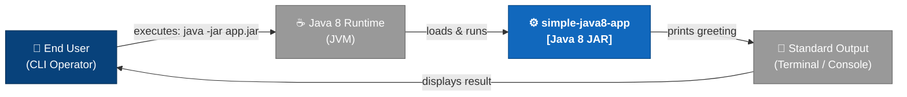

**Figure 3.1** — Business context: system boundaries and external actors.

### 3.2 Technical Context

From a technical perspective, the application interacts with exactly two external systems:

| Interface | Direction | Protocol / Mechanism | Description |
|-----------|-----------|---------------------|-------------|
| JVM `main()` invocation | Inbound | OS process launch (`java -jar`) | JVM bootstraps the application by calling `HelloWorld.main(String[])` |
| `System.out.println()` | Outbound | POSIX stdout (file descriptor 1) | Application writes the greeting line to the standard output stream |

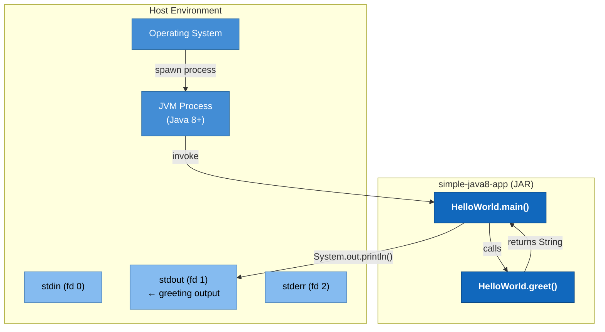

**Figure 3.2** — Technical context: infrastructure interfaces and I/O channels.

---

## 4. Solution Strategy

### 4.1 Technology Decisions

| Decision | Choice | Rationale |
|---------|--------|-----------|
| **Language** | Java 8 | Stable LTS-era language with wide JVM availability; mandated by TC-1 |
| **Build tool** | Apache Maven 3.x | Industry-standard; enforces reproducible builds via dependency coordinates |
| **Packaging** | Executable JAR | Single-artefact distribution; JVM portable; no installer required |
| **Testing** | JUnit 4.13.2 | Mature, widely understood test framework; sufficient for the project's scope |
| **Runtime dependencies** | None | Maximises portability and eliminates supply-chain risk |

### 4.2 Decomposition Strategy

The application applies the **static utility class** pattern. All behaviour is encoded as `public static` methods, removing the need for object lifecycle management. This is appropriate given:

- There is no mutable state to protect.
- There is no dependency injection requirement.
- The primary use case is a single, side-effect-free string transformation.

### 4.3 Achieving Quality Goals

| Quality Goal | Strategy Applied |
|-------------|-----------------|
| **Correctness** | Pure function `greet()` — same input always yields same output; validated by two JUnit tests |
| **Testability** | Static method signature allows direct invocation without mocking or test doubles |
| **Simplicity** | Single class, two methods, zero runtime dependencies |
| **Portability** | Compiled to Java 8 bytecode; standard library only |
| **Maintainability** | Greeting logic isolated to one method — single point of change |

---

## 5. Building Block View

### 5.1 Level 1 — System Decomposition

At the highest level, the system consists of a single deployable unit — the executable JAR — with one production package and one test package.

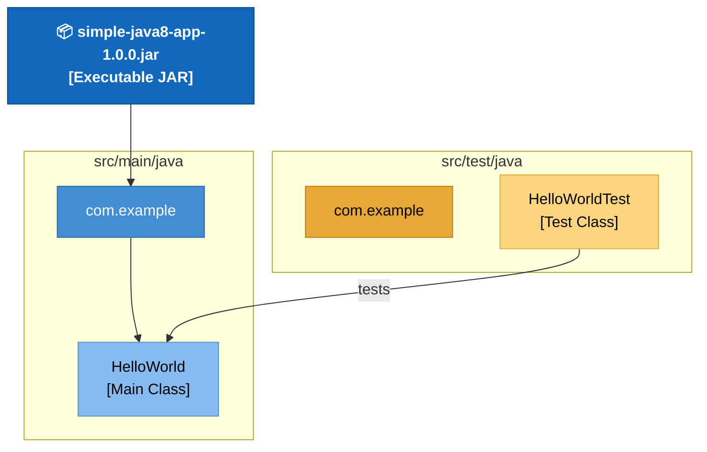

**Figure 5.1** — Level 1: top-level building blocks.

### 5.2 Level 2 — Package Structure

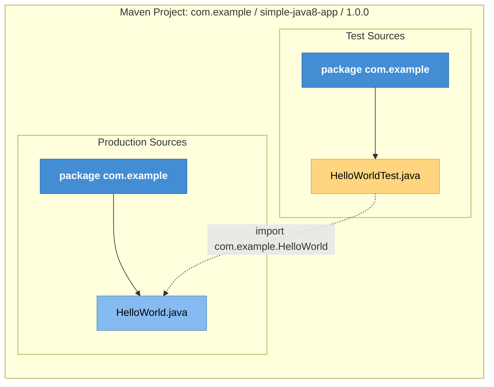

**Figure 5.2** — Level 2: package and class layout.

### 5.3 Level 3 — Class Detail

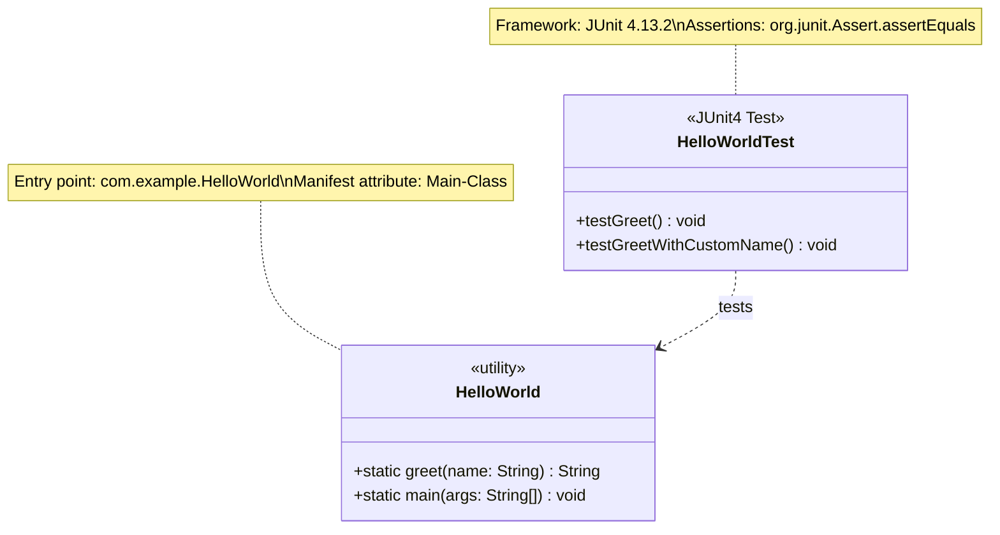

**Figure 5.3** — Level 3: detailed class structure with stereotypes and relationships.

### 5.4 Component Responsibilities

| Component | Responsibility | Type |
|-----------|---------------|------|
| `HelloWorld` | Greeting logic + CLI entry point | Static utility class |
| `HelloWorld.greet(String)` | Pure function: constructs `"Hello, <name>!"` | Static method |
| `HelloWorld.main(String[])` | JVM entry point; calls `greet("World")` and prints result | Static method |
| `HelloWorldTest` | Validates `greet()` for multiple name inputs | JUnit 4 test class |

---

## 6. Runtime View

### 6.1 Scenario 1 — Normal CLI Execution

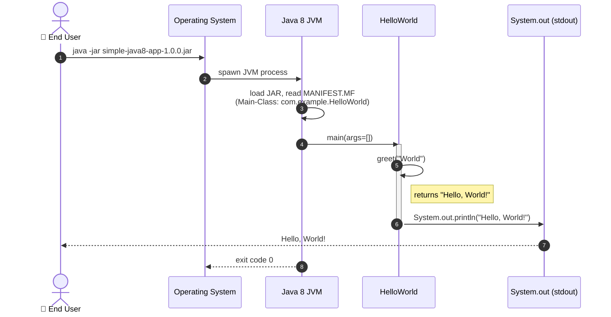

**Figure 6.1** — Runtime sequence: standard CLI execution producing `"Hello, World!"`.

### 6.2 Scenario 2 — Programmatic / Library Usage

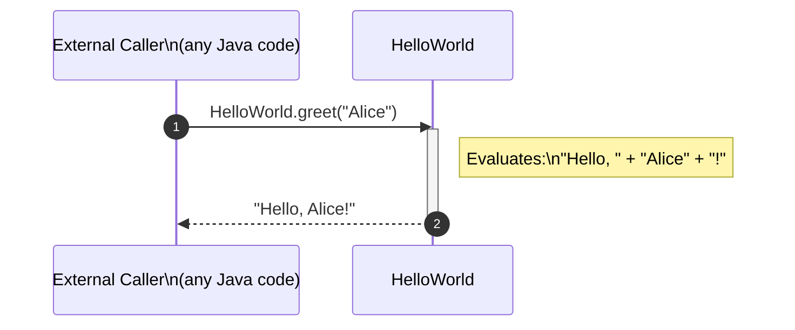

**Figure 6.2** — Runtime sequence: programmatic invocation of `greet()` as a library call.

### 6.3 Scenario 3 — Unit Test Execution (`mvn test`)

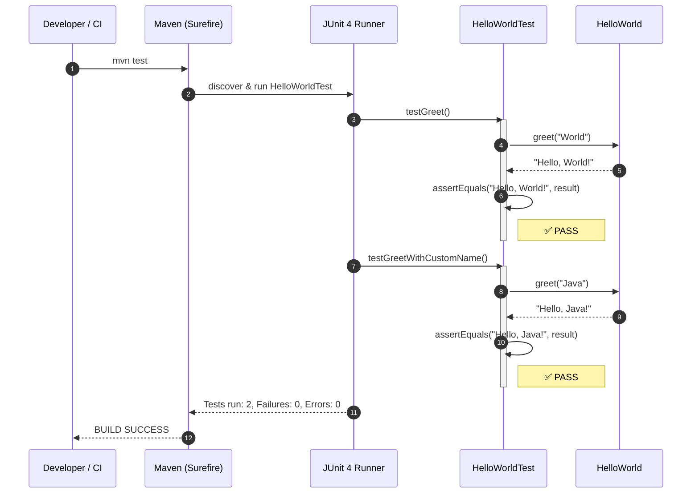

**Figure 6.3** — Runtime sequence: full Maven test lifecycle with JUnit 4.

### 6.4 Application State Model

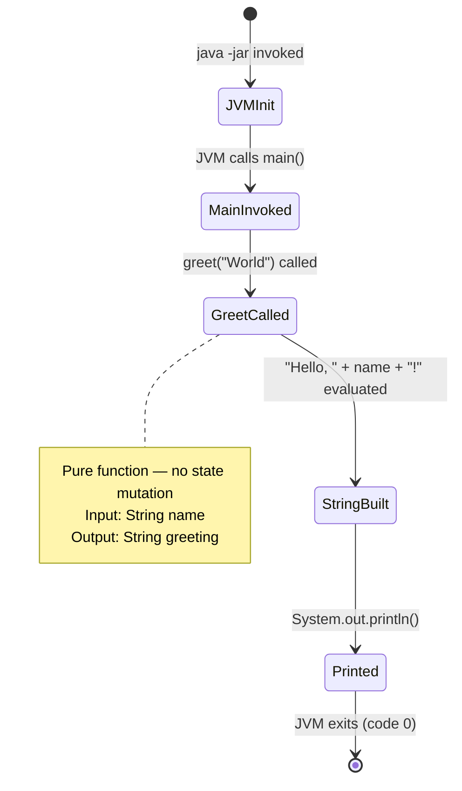

**Figure 6.4** — Application state machine for a single CLI execution.

---

## 7. Deployment View

### 7.1 Infrastructure Requirements

| Requirement | Minimum | Recommended |
|-------------|---------|-------------|
| **JRE version** | Java 8 (JRE 1.8.0) | Java 11+ LTS |
| **CPU** | Any x86/x64/ARM with JVM support | N/A |
| **Memory** | ~20 MB (JVM overhead) | N/A |
| **Disk** | < 5 KB (JAR size) | N/A |
| **OS** | Any OS with Java 8 JRE | Linux, macOS, Windows |
| **Network** | None required | N/A |

### 7.2 Build Pipeline

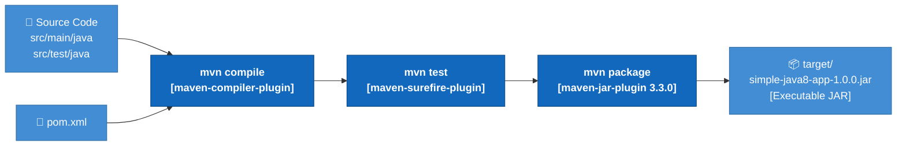

**Figure 7.1** — Maven build pipeline from source to executable JAR.

### 7.3 Deployment Topology

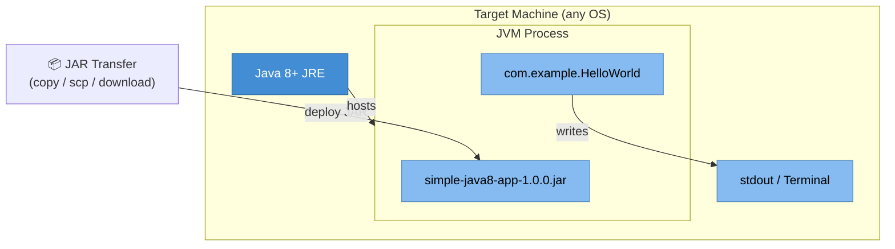

**Figure 7.2** — Target deployment topology: single JAR on any JRE-equipped machine.

### 7.4 Deployment Steps

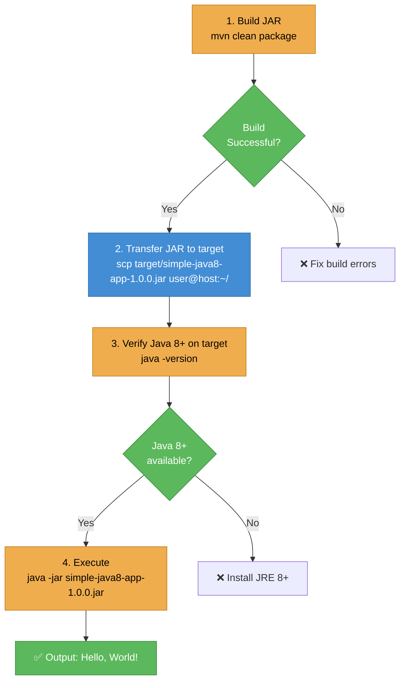

**Figure 7.3** — Step-by-step deployment procedure.

---

## 8. Cross-cutting Concepts

### 8.1 Domain Model

The domain is intentionally trivial. There is a single domain concept:

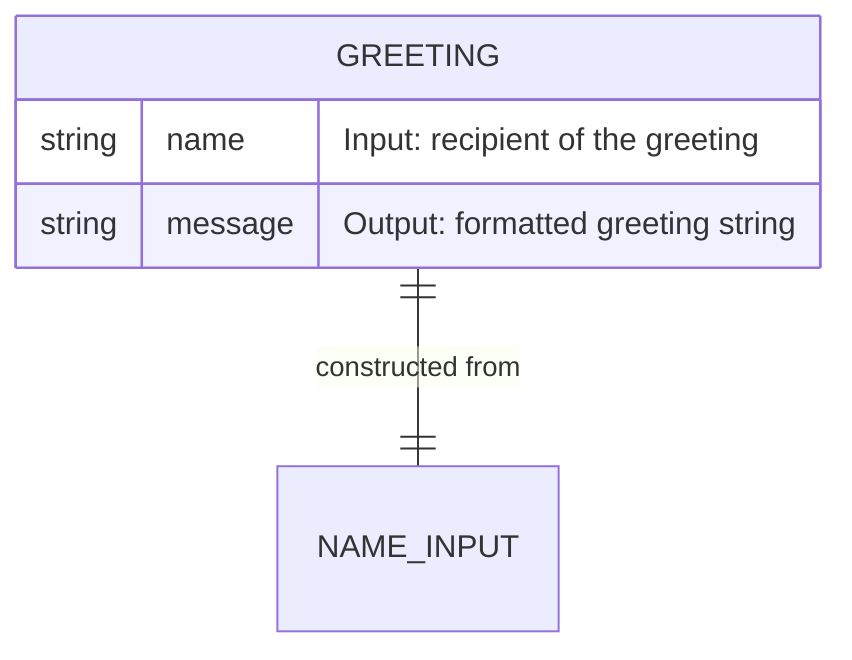

**Figure 8.1** — Minimal domain model: a greeting is constructed from a name input.

### 8.2 Design Patterns Identified

| Pattern | Location | Description |
|---------|----------|-------------|
| **Static Utility Class** | `HelloWorld` | All members are `static`; the class is never instantiated. Appropriate for stateless helper logic. |
| **Pure Function** | `HelloWorld.greet()` | No side effects, no external dependencies; output is deterministic given input. |
| **Facade / Entry Point** | `HelloWorld.main()` | Thin orchestration method — delegates to `greet()` and handles I/O. |

### 8.3 Logging and Observability

| Aspect | Current State | Recommendation |
|--------|--------------|---------------|
| **Logging** | None — `System.out.println()` is used directly | Introduce SLF4J + Logback for structured logging if the application grows |
| **Error handling** | None — no exception handling in `main()` | Add `try-catch` for `System.out` failures in production-grade versions |
| **Metrics** | None | Not required at current scale |
| **Tracing** | None | Not required at current scale |

### 8.4 Security Concepts

| Concern | Current State | Notes |
|---------|--------------|-------|
| **Input validation** | None | The `name` parameter in `greet()` accepts any `String`, including `null` → would produce `"Hello, null!"` |
| **Injection risk** | Not applicable | No SQL, OS command, or HTML rendering |
| **Dependencies** | Zero runtime deps | No external libraries → minimal supply-chain attack surface |
| **Classpath** | Standard library only | No reflection, no dynamic class loading |

### 8.5 Error and Edge Case Handling

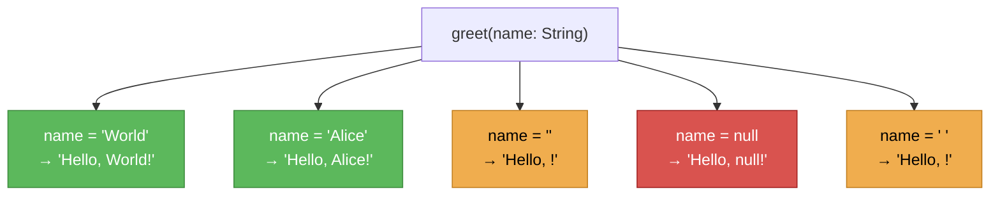

**Figure 8.2** — Edge case analysis for `greet(String name)`.

### 8.6 Build and Test Conventions

| Convention | Detail |
|-----------|--------|
| **Build lifecycle** | Standard Maven phases: `validate → compile → test → package` |
| **Test execution** | `mvn test` triggers Surefire; discovers all `*Test.java` classes |
| **JAR manifest** | `Main-Class: com.example.HelloWorld` set by maven-jar-plugin |
| **Encoding** | UTF-8 enforced at compiler and resource level |

---

## 9. Architecture Decisions

### ADR-001 — Static Utility Class Pattern

| Field | Value |
|-------|-------|
| **ID** | ADR-001 |
| **Status** | Accepted |
| **Context** | The application performs a single, stateless string transformation with no dependencies on external resources or mutable state. |
| **Decision** | Implement `HelloWorld` as a static utility class with only `static` methods, following the pattern used by `java.util.Collections` and `java.util.Arrays`. |
| **Consequences (+)** | Simplest possible API; no object lifecycle to manage; easy to test via direct method calls. |
| **Consequences (-)** | Not extensible via inheritance or interface implementation; does not support dependency injection frameworks. |

---

### ADR-002 — Java 8 Language Level

| Field | Value |
|-------|-------|
| **ID** | ADR-002 |
| **Status** | Accepted |
| **Context** | A baseline Java version must be selected for compilation and runtime compatibility. |
| **Decision** | Target Java 8 (`maven.compiler.source=8`, `maven.compiler.target=8`). |
| **Consequences (+)** | Compatible with the widest installed base of JREs, including many enterprise environments still on Java 8 LTS. |
| **Consequences (-)** | Cannot use language features from Java 9–21 (records, text blocks, sealed classes, switch expressions, etc.). |
| **Recommendation** | Migrate to Java 17 LTS (or Java 21 LTS) to benefit from modern language features, improved GC, and continued security support. |

---

### ADR-003 — No Runtime Dependencies

| Field | Value |
|-------|-------|
| **ID** | ADR-003 |
| **Status** | Accepted |
| **Context** | The application could use external libraries (e.g., Apache Commons Lang `StringUtils`) for string manipulation. |
| **Decision** | Use only the Java standard library for all production code. |
| **Consequences (+)** | Zero third-party JAR on the classpath; eliminates licensing concerns; no transitive dependency conflicts. |
| **Consequences (-)** | Limits available utilities if the application scope expands. |

---

### ADR-004 — JUnit 4 for Testing

| Field | Value |
|-------|-------|
| **ID** | ADR-004 |
| **Status** | Accepted |
| **Context** | A test framework must be selected for unit testing. |
| **Decision** | Use JUnit 4.13.2 (the latest stable JUnit 4 release). |
| **Consequences (+)** | Mature, well-documented, widely understood; adequate for the project's two test cases. |
| **Consequences (-)** | JUnit 4 is in maintenance mode; JUnit 5 (JUnit Platform / Jupiter) is the current standard and offers parameterised tests, extensions API, and improved output. |
| **Recommendation** | Migrate to JUnit 5 (`junit-jupiter`) to align with the current ecosystem. |

---

## 10. Quality Requirements

### 10.1 Quality Tree

```mermaid
mindmap
  root((Quality))
    Reliability
      Deterministic output
      No runtime exceptions for valid input
    Testability
      100% method coverage
      JUnit 4 test suite
      2 of 2 test cases passing
    Maintainability
      Single Responsibility
      One class, two methods
      No cyclomatic complexity
    Portability
      Java 8 bytecode
      No OS-specific code
      Zero runtime deps
    Performance
      O(1) string concat
      Sub-millisecond response
    Security
      No external IO
      No runtime deps
      null input edge case
```

**Figure 10.1** — Quality attribute tree.

### 10.2 Quality Scenarios

| ID | Quality Attribute | Stimulus | Response | Measure |
|----|------------------|---------|----------|---------|
| QS-1 | **Correctness** | `greet("World")` called | Returns `"Hello, World!"` | Exact string match (asserted in `testGreet()`) |
| QS-2 | **Correctness** | `greet("Java")` called | Returns `"Hello, Java!"` | Exact string match (asserted in `testGreetWithCustomName()`) |
| QS-3 | **Portability** | JAR executed on Java 8 JRE | Prints greeting to stdout | Exit code 0; correct output |
| QS-4 | **Portability** | JAR executed on Java 17 JRE | Prints greeting to stdout | Exit code 0; correct output (backward-compatible bytecode) |
| QS-5 | **Build reproducibility** | `mvn clean package` on any machine | JAR produced | BUILD SUCCESS; identical bytecode |
| QS-6 | **Security — null input** | `greet(null)` called | Returns `"Hello, null!"` | No `NullPointerException` thrown (but semantically incorrect output) |

### 10.3 Code Quality Metrics

| Metric | Value | Assessment |
|--------|-------|-----------|
| **Lines of Code (production)** | 12 | Minimal ✅ |
| **Lines of Code (test)** | 17 | Appropriate ✅ |
| **Number of classes (production)** | 1 | Single Responsibility ✅ |
| **Number of methods (production)** | 2 | Focused ✅ |
| **Cyclomatic Complexity** | 1 (both methods) | No branching logic ✅ |
| **Test coverage (methods)** | 1/2 = 50% | `main()` not directly tested ⚠️ |
| **Test coverage (meaningful logic)** | 100% | `greet()` fully covered ✅ |
| **Runtime dependencies** | 0 | Minimal risk ✅ |
| **Static analysis issues** | 0 (inferred) | Clean ✅ |

> **Note on coverage**: `HelloWorld.main()` is a thin wrapper calling `greet()` and `System.out.println()`. Testing it directly would require stdout capture infrastructure. The meaningful business logic in `greet()` achieves 100% coverage through the two existing test cases.

---

## 11. Risks and Technical Debt

### 11.1 Risk Register

| ID | Risk | Probability | Impact | Mitigation |
|----|------|-------------|--------|-----------|
| R-1 | **Java 8 EOL** — Oracle's public Java 8 updates ended in March 2022 (commercial support ongoing) | Medium | Medium | Migrate to Java 17 LTS or Java 21 LTS; update `pom.xml` compiler properties |
| R-2 | **JUnit 4 maintenance mode** — no new features; security patches may be delayed | Low | Low | Migrate to JUnit 5 (`junit-jupiter`); update test imports and annotations |
| R-3 | **Null input not guarded** — `greet(null)` returns `"Hello, null!"` silently | Low | Low | Add null check in `greet()`: `if (name == null) throw new IllegalArgumentException(...)` or return a default |
| R-4 | **No CI/CD configuration** — no `.github/workflows/*.yml` or equivalent detected | Medium | Medium | Add a GitHub Actions workflow for `mvn verify` on push/PR |
| R-5 | **Single-class scalability** — as requirements grow, `HelloWorld` will accrete responsibilities | Low | Medium | Introduce separation of concerns early (e.g., `GreetingService`, `CliRunner`) |

### 11.2 Technical Debt

```mermaid
quadrantChart
    title Technical Debt — Effort vs Impact
    x-axis Low Effort --> High Effort
    y-axis Low Impact --> High Impact
    quadrant-1 Quick Wins
    quadrant-2 Major Projects
    quadrant-3 Fill In Later
    quadrant-4 Hard Slogs

    Add null guard in greet(): [0.15, 0.35]
    Add CI/CD workflow: [0.25, 0.75]
    Migrate to JUnit 5: [0.35, 0.45]
    Migrate to Java 17 LTS: [0.45, 0.80]
    Add integration test for main(): [0.20, 0.30]
    Add SLF4J logging: [0.40, 0.25]
```

**Figure 11.1** — Technical debt quadrant: effort vs. impact.

### 11.3 Debt Items Detail

| ID | Debt Item | Category | Effort | Priority |
|----|-----------|----------|--------|----------|
| TD-1 | Add `null` guard to `greet(String name)` | Code quality | XS (< 1h) | Medium |
| TD-2 | Configure GitHub Actions CI pipeline (`mvn verify`) | Infrastructure | S (1–2h) | High |
| TD-3 | Migrate from JUnit 4 to JUnit 5 | Testing | S (1–2h) | Medium |
| TD-4 | Upgrade Java 8 → Java 17 LTS | Platform | M (2–4h) | High |
| TD-5 | Add direct test coverage for `main()` using stdout capture | Testing | S (1–2h) | Low |
| TD-6 | Introduce SLF4J + Logback for structured logging | Observability | M (2–4h) | Low |
| TD-7 | Add Checkstyle / SpotBugs to Maven build | Code quality | S (1–2h) | Medium |

### 11.4 Recommended Improvement Roadmap

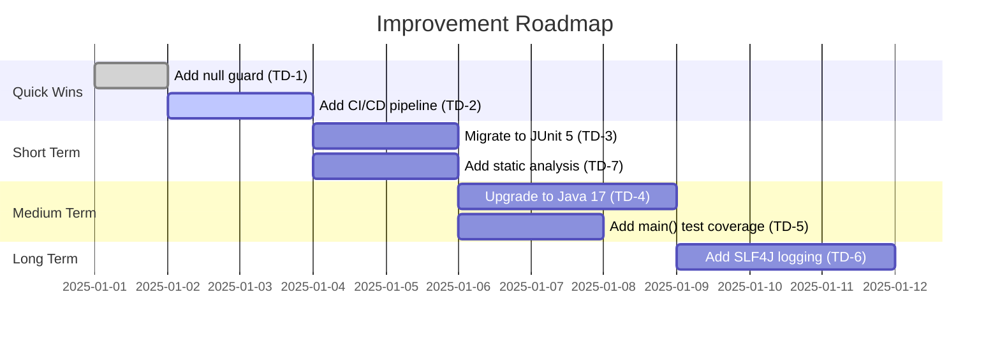

**Figure 11.2** — Suggested prioritisation and sequencing for debt remediation.

---

## 12. Glossary

| Term | Definition |
|------|-----------|
| **Arc42** | A pragmatic template for software architecture documentation, structured into 12 sections. See [arc42.org](https://arc42.org). |
| **Artifact** | In Maven, the packaged output of a build (here: `simple-java8-app-1.0.0.jar`). |
| **artifactId** | Maven coordinate component identifying the project within a group: `simple-java8-app`. |
| **Bytecode** | Platform-independent compiled form of Java source code, executed by the JVM. |
| **CI/CD** | Continuous Integration / Continuous Deployment — automated pipeline for building, testing, and deploying software. |
| **Classpath** | The list of locations (JAR files, directories) the JVM searches for class definitions at runtime. |
| **Cyclomatic Complexity** | A software metric measuring the number of linearly independent paths through a method's control flow graph. A value of 1 indicates no branching. |
| **Executable JAR** | A JAR archive containing a `META-INF/MANIFEST.MF` with a `Main-Class` attribute, allowing it to be run directly via `java -jar`. |
| **groupId** | Maven coordinate component identifying the organisation or group: `com.example`. |
| **greet(String name)** | The core method of `HelloWorld` — a pure function that returns `"Hello, <name>!"`. |
| **HelloWorld** | The single production class in this application, located in package `com.example`. |
| **HelloWorldTest** | The JUnit 4 test class that validates the behaviour of `HelloWorld.greet()`. |
| **JAR** | Java ARchive — a ZIP-format file bundling compiled `.class` files and resources. |
| **Java 8** | The 8th major release of the Java platform (JDK 1.8), released March 2014. LTS release by Oracle classification. |
| **JRE** | Java Runtime Environment — the subset of the JDK required to *run* (not compile) Java applications. |
| **JUnit 4** | A widely-used Java testing framework; version 4 uses annotations (`@Test`) and the `Assert` class for assertions. |
| **JVM** | Java Virtual Machine — the runtime engine that executes Java bytecode. |
| **LTS** | Long-Term Support — a release designated for extended maintenance and security patches. |
| **Main-Class** | The JAR manifest attribute pointing to the class whose `main(String[])` method the JVM invokes on startup. |
| **main(String[] args)** | The standard JVM entry-point method; in this project it calls `greet("World")` and prints the result. |
| **Maven** | Apache Maven — a build automation and project management tool for Java, driven by a `pom.xml` descriptor. |
| **maven-jar-plugin** | Maven plugin responsible for packaging compiled classes into a JAR archive and configuring its manifest. |
| **Null safety** | The practice of guarding against `null` values to prevent `NullPointerException`. Currently not implemented in `greet()`. |
| **POM** | Project Object Model — the `pom.xml` file that declares a Maven project's coordinates, dependencies, and build configuration. |
| **Pure function** | A function whose return value depends only on its input parameters and has no side effects. `greet()` is a pure function. |
| **Semantic Versioning** | A versioning scheme (`MAJOR.MINOR.PATCH`) where version numbers convey meaning about backward compatibility. |
| **Surefire** | The Maven plugin (`maven-surefire-plugin`) that discovers and executes unit tests during the `test` lifecycle phase. |
| **Static utility class** | A class designed to be used without instantiation; all its methods are `static`. |
| **stdout** | Standard Output stream (file descriptor 1) — the default destination for `System.out.println()` output. |
| **UTF-8** | An 8-bit Unicode encoding used as the source file and build encoding for this project. |

---

*Documentation generated by the **Arc42 Documentation Generator** agent.*
*Source analysed: `com.example:simple-java8-app:1.0.0` at `/home/runner/work/nowytest/nowytest`*
*All diagrams rendered as embedded Mermaid code blocks — no external image references.*
